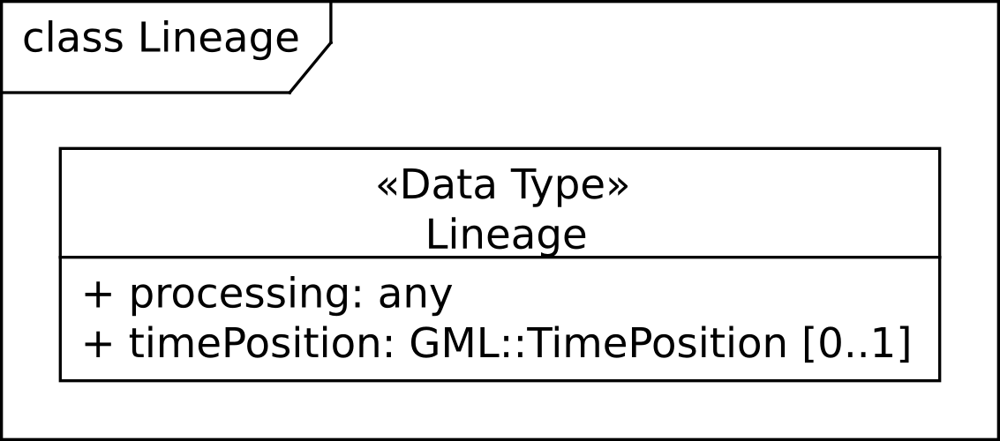
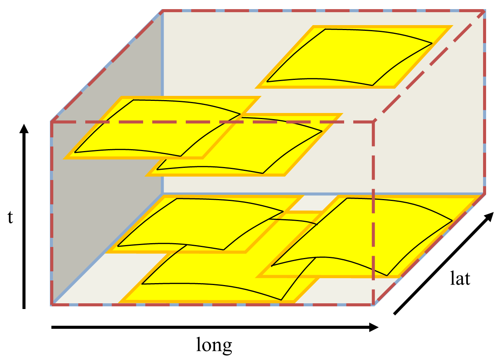

[#eo_data_model,reftext='6']
== EO data model

=== Overview

This Clause <<eo_data_model>>, together with Clauses <<eo_service_model>> and
<<wcs_extensions>>, establishes the EO-WCS core requirements class, _eowcs_ as
well as the _eowcs_geteocoverageset_ one where stated, particularly subclause
<<geteocoverageset_operation>>.

The data model of this EO-WCS centers around the data structure of an Earth
Observation coverage (EO Coverage), which is a coverage extended with EO
Metadata [OGC 10-157r4] and bound to a location on the Earth. EO Coverages are a
subtype of either `GMLCOV::RectifiedGridCoverage` or
`GMLCOV::ReferenceableGridCoverage`.

Based on this EO Coverage concept (cf. Subclause 6.3), three main data elements
are defined:

* A _Dataset_ is an EO Coverage, which can represent, for example, a
hyperspectral 2D satellite scene or a 3D atmospheric model; cf. Subclause  6.4.
A Dataset can be a Rectified Dataset or a Referenceable Dataset, depending on
the type of EO Coverage it is derived from.

* A _Stitched Mosaic_ is a collection of EO Coverages referring
to co-referenced Datasets; cf. Subclause 6.5. A Stitched Mosaic can be a
Rectified Stitched Mosaic or a Referenceable Stitched Mosaic, depending on the
type of EO Coverage it is derived from. A Stitched Mosaic can be interpreted
(i.e. requested) as a single coverage.

* A _Dataset Series_ is a collection of coverages and/or Dataset Series; cf.
Subclause 6.6. A Dataset Series can refer to any number of Datasets, Stitched
Mosaics, and Dataset Series. A Dataset Series is not a coverage itself.

NOTE: <<__informative_use_case_examples>> provides Use Cases to motivate the
definition of these data elements.

NOTE: Although named _Dataset Series_ technically speaking it is a heterogeneous
grouping of coverages and/or Dataset Series and can thus be used for any other
concept like an EO Product containing multiple coverages with different
resolutions as well.

<<datasetseries_conceptual>> informally symbolizes how the concepts of Dataset,
Stitched Mosaic, and Dataset Series relate to each other spatio-temporally:

* A - a Dataset with a particular validity in time;

* B - a Stitched Mosaic; all its Datasets have a spatial extent contained in the
Stitched Mosaic's spatial extent and a timespan contained in the Stitched
Mosaic's time interval. The subsets contributing to the Stitched Mosaic do not
overlap in space, but there may be empty (nil) areas.

* C - the overall Dataset Series combining Datasets and Stitched Mosaics.

[#datasetseries_conceptual,reftext='{figure-caption} {counter:figure-num}']
.Conceptual view of a Dataset Series with Stitched Mosaic and Dataset

<<uml_model>> contains the UML diagram defining classes (types) and their
correlations in the EO-WCS.

=== EO Metadata

Every EO Coverage contains _EO Metadata_, consisting of an EarthObservation
record as defined in the OGC Earth Observation Metadata Profile of Observations
and Measurements [OGC 10-157r4] and a lineage describing the history of
operations leading to the coverage on hand.

[requirement,uri="/req/eowcs/eo-metadata-structure"]
A `EOWCS::EOMetadata` instance *shall* conform to <<eometadata_components>>,
<<uml_model>>, <<uml_lineage_class>>, and the
http://schemas.opengis.net/wcs/wcseo/1.1/[XML Schema] being part of this
standard.

[#eometadata_components,reftext='{table-caption} {counter:table-num}']
.Components of `EOWCS::EOMetadata` structure
[cols="2,3,2,^1",options="header"]
|===============================================================================
|Name             |Definition                           |Data type |Multiplicity
|earthObservation |EO metadata record for this coverage object |
`EOP::EarthObservation` |one (mandatory)
|lineage          |History record describing an operation that has been applied
to this object |`EOWCS::Lineage` |zero or more (optional)
|===============================================================================

[#uml_model,reftext='{figure-caption} {counter:figure-num}']
.UML Model of WCS EO Application Profile Schema

NOTE: Throughout this standard, `eop:` and `EOP::` can be substituted by `opt:`
and `OPT::` or `sar:` and `SAR::`, respectively, as in [OGC 10-157r4] `opt` and
`sar` are in the substitution group of `eop`.

[#uml_lineage_class,reftext='{figure-caption} {counter:figure-num}']
.UML Lineage class diagram

NOTE: The lineage records are supposed to describe the history of processing
steps that has led to the coverage on hand. As at the time of this writing there
is no canonical format for such histories available in OGC, for the purpose of
this specification no assumption is made about the contents of a lineage record,
except that GetCoverage appends its request verbatim as an additional record
(see <</req/eowcs/getCoverage-response-lineage-in-eo-metadata>>).

The footprint of an EO Coverage, which contains one or more bounding polygons to
describe the region of valid data more accurately than the EO Coverage's
bounding box, is mandatory as opposed to [OGC 10-157r4].

[requirement,uri="/req/eowcs/footprint-in-eo-metadata"]
The `EOWCS::EOMetadata` element of `EOWCS::ReferenceableEOCoverage` and
`EOWCS::RectifiedEOCoverage` instances *shall* contain an
`eop:EarthObservation/om:featureOfInterest/eop:Footprint` element.

NOTE: As per [OGC 10-157r4], the footprint is always given in WGS84.

=== EO Coverage

==== Overview

An _EO Coverage_ is a coverage as defined in the Coverages Implementation
Schema (renamed from GML Application Schema - Coverages) [OGC 09-146r2]. EO
Coverages appear in two variants:

* _Rectified EO Coverages_ are derived from Rectified Grid Coverage as defined
in [OGC 09-146r2];

* _Referenceable EO Coverages_ are derived from Referenceable Grid Coverage as
defined in [OGC 09-146r2].

[requirement,uri="/req/eowcs/eo-coverage-structure"]
`EOWCS::ReferenceableEOCoverage` and `EOWCS::RectifiedEOCoverage` instances
*shall* conform to <<uml_model>>, <<uml_lineage_class>>, and the
http://schemas.opengis.net/wcs/wcseo/1.1/[XML Schema] being part of this
standard.

NOTE: An _EO Coverage_ can have any number of dimensions as long as it adheres
to the requirements below. Particularly it needs a footprint bound to the Earth
and a temporal validity.

==== EO Metadata

An EO Coverage has an EO Metadata record associated.

[requirement,uri="/req/eowcs/eo-metadata-in-eo-coverage"]
`EOWCS::ReferenceableEOCoverage` and `EOWCS::RectifiedEOCoverage` instances
*shall* contain one metadata element of type `EOWCS::EOMetadata`.

NOTE: Besides this specific metadata element there may be further metadata
elements.

NOTE: According to the rules of GML, a xlink:href URI to an accessible element
of type `EOWCS::EOMetadata` can be provided instead of the element itself in any
place of the XML Schema where such a metadata record appears.

The EO Metadata record associated with an EO Coverage contains a back reference
to the coverage.

[requirement,uri="/req/eowcs/eop-identifier-in-eo-metadata"]

The `EOWCS::EOMetadata` element of `EOWCS::ReferenceableEOCoverage` and
`EOWCS::RectifiedEOCoverage` instances shall contain an element
`eop:EarthObservation/eop:metadataProperty/eop:EarthObservationMetaData/eop:identifier`
whose first word (NCNAME type substring i.e. starting from it's first character
up to and excluding the first character which is not allowed in an NCName) is
identical to the EO Coverage identifier.

NOTE: Normally, this word (i.e. NCName) acting as coverage identifier will be
the only contents of the `eop:identifier` string and thus both elements will be
equal.

==== Spatio-temporal extent

The EO Coverage's extent of valid data is given by its EO Metadata footprint,
which refines the coverage's envelope.

[requirement,uri="/req/eowcs/footprint-inside-boundedBy"]
In `EOWCS::ReferenceableEOCoverage` and `EOWCS::RectifiedEOCoverage` instances,
all polygons listed in `eop:EarthObservation/om:featureOfInterest/eop:Footprint`
element *shall* be geometrically contained in the bounding box of the
`gml:boundedBy` element of the `gml:Envelope`.

NOTE: By definition, the footprint is expressed in WGS84.

An EO Coverage has a time period of validity associated.

[requirement,uri="/req/eowcs/phenomenonTime-in-eo-metadata"]
The `EOWCS::EOMetadata` element of a `EOWCS::ReferenceableEOCoverage` or
`EOWCS::RectifiedEOCoverage` instance *shall* contain elements
`eop:EarthObservation/om:phenomenonTime/gml:TimePeriod/gml:beginPosition` and
`eop:EarthObservation/om:phenomenonTime/gml:TimePeriod/gml:endPosition` where
`beginPosition ≤ endPosition`.

NOTE: This typically is the time period where image acquisition has taken place.

[requirement,uri="/req/eowcs/phenomenonTime-iso8601"]
For any given EO Coverage, its temporal validity values *shall* be expressed in
ISO 8601 <<2>>.

==== Range type

The range type of an EO Coverage is extended to include further useful
information for example to know how to convert stored numbers to physical
properties.

[requirement,uri="/req/eowcs/rangeTypeExtension"]
If additional range type information is made available then the
`gmlcov:rangeType` element of `EOWCS::ReferenceableEOCoverage` and
`EOWCS::RectifiedEOCoverage` instances *shall* contain
`wcseo:rangeTypeExtension` elements either under the
`swe:DataRecord/swe:extension` or each
`swe:DataRecord/swe:field/swe:Quantity/swe:extension` element or both.

[requirement,uri="/req/eowcs/rangeType-uom"]
In `EOWCS::ReferenceableEOCoverage` and `EOWCS::RectifiedEOCoverage` instances,
the `code` attribute of the `swe:uom` element of each `swe:Quantity` element in
the `gmlcov:rangeType` element *shall* hold the unit of the measured physical
property.

NOTE: The data type is provided explicitly in the `wcseo:rangeTypeExtension`
element or implicitly via the actual coverage encoding.

[requirement,uri="/req/eowcs/rangeType-name"]
In `EOWCS::ReferenceableEOCoverage` and `EOWCS::RectifiedEOCoverage` instances,
the `swe:identifier` element of each `swe:Quantity` element under each
`swe:field` element *shall* hold the URL-encoded identifier of the respective
field (also referred to as band or channel) and the `name` attribute of each
`swe:field` element *shall* hold the first word (NCNAME type substring i.e.
starting from it’s first character up to and excluding the first character
which is not allowed in an NCName) of the identifier of the respective field.

NOTE: Typically the two values are identical. This requirement addresses cases
where the identifier includes characters not allowed in `NCName` like `:`, `@`,
`$`, `%`, `&`, `/`, `+`, `,`, `;`, or any whitespace characters or where it
starts with a number, minus, or dot. For example an ID of `gray band` should
use `gray` for the `name` attribute and `gray%20band` for the `swe:identifier`
element.

Example: The following provides an example `gmlcov:rangeType` element including
additional range type information for RGB generation on `swe:DataRecord` level
as well as data conversion information on `swe:Quantity` level.

[source,xml]
<gmlcov:rangeType>
  <swe:DataRecord definition="http://www.opengis.net/def/property/OGC-EO/0/opt/SpectralMode/PANCHROMATIC">
    <swe:extension>
      <wcseo:rangeTypeExtension>
        <wcseo:RGBgenerationHint>
          <wcseo:bandSequence>gray gray gray</wcseo:bandSequence>
          <wcseo:intervalFrom>1 4095</wcseo:intervalFrom>
          <wcseo:intervalTo>1 255</wcseo:intervalTo>
          <wcseo:type>http://sweet.jpl.nasa.gov/2.3/reprMathFunction.owl#Logarithmic</wcseo:type>
        </wcseo:RGBgenerationHint>
      </wcseo:rangeTypeExtension>
    </swe:extension>
    <swe:label>Gray Channel/Band</swe:label>
    <swe:field name="gray">
      <swe:Quantity definition="http://sweet.jpl.nasa.gov/2.3/propEnergyFlux.owl#SpectralRadiance">
        <swe:extension>
          <wcseo:rangeTypeExtension>
            <wcseo:dataSemantics>http://sweet.jpl.nasa.gov/2.3/stateSpectralBand.owl#Visible</wcseo:dataSemantics>
            <wcseo:dataType>http://www.opengis.net/def/dataType/OGC/0/unsignedShort</wcseo:dataType>
            <wcseo:dataType2dataSemantics>
              <wcseo:intervalFrom>1 4095</wcseo:intervalFrom>
              <wcseo:intervalTo>390.0000 780.0000</wcseo:intervalTo>
              <wcseo:type>http://sweet.jpl.nasa.gov/2.3/reprMathFunction.owl#Linear</wcseo:type>
            </wcseo:dataType2dataSemantics>
          </wcseo:rangeTypeExtension>
        </swe:extension>
        <swe:identifier>gray%20band</swe:identifier>
        <swe:label>Gray Channel/Band</swe:label>
        <swe:description>Gray Channel/Band</swe:description>
        <swe:nilValues>
          <swe:NilValues>
            <swe:nilValue reason="http://www.opengis.net/def/nil/OGC/0/unknown">0</swe:nilValue>
          </swe:NilValues>
        </swe:nilValues>
        <swe:uom code="W.m-2.sr-1.nm-1"/>
        <swe:constraint>
          <swe:AllowedValues>
            <swe:interval>0 4095</swe:interval>
            <swe:significantFigures>4</swe:significantFigures>
          </swe:AllowedValues>
        </swe:constraint>
      </swe:Quantity>
    </swe:field>
  </swe:DataRecord>
</gmlcov:rangeType>

==== Range set

Cells outside the footprint hold only nil values.

[requirement,uri="/req/eowcs/range-set-of-eo-coverage"]
In `EOWCS::ReferenceableEOCoverage` and `EOWCS::RectifiedEOCoverage` instances,
all cells whose locations are outside the EO Metadata footprint when both are
evaluated in WGS84, *shall* contain nil values as defined in the bounding EO
Coverage's range type.

=== Dataset

A _Dataset_ is an EO Coverage as symbolized in <<dataset_conceptual>>. A Dataset
is either a Referenceable Dataset or a Rectified Dataset, derived from
`EOWCS::ReferenceableEOCoverage` or `EOWCS::RectifiedEOCoverage`, respectively.

NOTE: Typically, a Dataset represents a (single- or multi-band) satellite/aerial
image scene.

[requirement,uri="/req/eowcs/dataset-structure"]
A `EOWCS::ReferenceableDataset` and a `EOWCS::RectifiedDataset` *shall* conform
to <<uml_model>>, <<uml_lineage_class>>, and the
http://schemas.opengis.net/wcs/wcseo/1.1/[XML Schema] being part of this
standard.

[#dataset_conceptual,reftext='{figure-caption} {counter:figure-num}']
.Conceptual view of a Dataset: in referenced (left) and unreferenced coordinates (right)

NOTE: This definition includes the "field-of-View" of a sensor, or "cut",
according to sensor specific data specification at the resolution of the sensor
(also referred to as Level-0 or Level-1 data).

=== Stitched Mosaic

==== Overview

A _Stitched Mosaic_ is an identifiable, queryable, referenced EO Coverage as
symbolized in <<stitchedmosaic_conceptual>>. A Stitched Mosaic is either a
Referenceable Stitched Mosaic or a Rectified Stitched Mosaic, derived from
`EOWCS::ReferenceableEOCoverage` or `EOWCS::RectifiedEOCoverage`, respectively.

Stitched Mosaics _refer_ to one or more Datasets. All cells within a Stitched
Mosaic which are not located inside any `contributingFootprint` of any of the
contained Datasets carry nil values.

[#stitchedmosaic_conceptual,reftext='{figure-caption} {counter:figure-num}']
.Conceptual view of a Stitched Mosaic: composed from Datasets (Stitched Mosaic bounding box dashed)

[requirement,uri="/req/eowcs/referenceableStitchedMosaic-structure"]
`EOWCS::ReferenceableStitchedMosaic` instances *shall* conform to <<uml_model>>,
<<uml_lineage_class>>, <<refstitchedmosaic_components>>,
<<datasetreference_components>>, and the
http://schemas.opengis.net/wcs/wcseo/1.1/[XML Schema] being part of this
standard.

[#refstitchedmosaic_components,reftext='{table-caption} {counter:table-num}']
.Components of `EOWCS::ReferenceableStitchedMosaic` structure
[cols="2,3,2,^1",options="header"]
|===============================================================================
|Name    |Definition                                    |Data type |Multiplicity
|dataset |Reference to a Referenceable Dataset referred to by the Stitched
Mosaic on hand |`EOWCS::DatasetReference` |one or more (mandatory)
|===============================================================================

[requirement,uri="/req/eowcs/rectifiedStitchedMosaic-structure"]
`EOWCS::RectifiedStitchedMosaic` instances *shall* conform to <<uml_model>>,
<<uml_lineage_class>>, <<rectstitchedmosaic_components>>,
<<datasetreference_components>>, and the
http://schemas.opengis.net/wcs/wcseo/1.1/[XML Schema] being part of this
standard.

[#rectstitchedmosaic_components,reftext='{table-caption} {counter:table-num}']
.Components of `EOWCS::RectifiedStitchedMosaic` structure
[cols="2,3,2,^1",options="header"]
|===============================================================================
|Name    |Definition                                    |Data type |Multiplicity
|dataset |Reference to a Rectified Dataset referred to by the Stitched Mosaic on
hand |`EOWCS::DatasetReference` |one or more (mandatory)
|===============================================================================

[#datasetreference_components,reftext='{table-caption} {counter:table-num}']
.Components of `EOWCS::DatasetReference` structure
[cols="2,3,2,^1",options="header"]
|===============================================================================
|Name                  |Definition                      |Data type |Multiplicity
|datasetId             |Dataset referred to by the Stitched Mosaic on hand
|`WCS::CoverageId` |one (mandatory)
|contributingFootprint | Horizontal bounding polygon enclosing data areas of the
Dataset contributing to the Stitched Mosaic on hand |`EOP::Footprint` |zero or
one (optional)
|===============================================================================

The Dataset references of an EO Coverage shall be consistent with the coverage's
EO Metadata references.

[requirement,uri="/req/eowcs/composedOf-in-stitched-mosaic"]
In `EOWCS::ReferenceableStitchedMosaic` and `EOWCS::RectifiedStitchedMosaic`
instances with at least one `eop:EarthObservation/eop:metaDataProperty/eop:Earth
ObservationMetaData/eop:composedOf`, the set of these elements *shall* be equal
to the set of `dataset` identifiers of the Stitched Mosaic.

==== Spatio-temporal extent

A Stitched Mosaic is defined through a collection of spatially non-overlapping
subsets of Datasets it refers to.

[requirement,uri="/req/eowcs/contributingFootprint-inside-footprint"]
For all Stitched Mosaics _sm_ referring to some Datasets _d_ with an associated
`contributingFootprint`, this `contributingFootprint` *shall* be geographically
contained in the footprint of _d_.

[requirement,uri="/req/eowcs/contributingFootprint-pairwise-disjoint"]
For all Stitched Mosaics _sm_ referring to Datasets _d~1~_ and _d~2~_, with an
associated `contributingFootprint`, the ``contributingFootprint``s of the _d~1~_
and _d~2~_ references *shall* be pair-wise disjoint.

[requirement,uri="/req/eowcs/contributingFootprint-union-of-footprints"]
The footprint of a Stitched Mosaic *shall* be given by the union of the
``contributingFootprint``s of the Datasets this Stitched Mosaic refers to.

[requirement,uri="/req/eowcs/dataset-domain-set-in-stitched-mosaic-domain-set"]
For all Datasets _d_ referred to by some Stitched Mosaics _sm_, all cells of _d_
as defined by the domain set of _d_ *shall* be contained in the set of cells of
_sm_ as defined by the domain set of _sm_.

Datasets referred to by a Stitched Mosaic shall have aligned cell locations:

* In case of Rectified EO Coverages, the grids of Datasets of a Stitched Mosaics shall
  have the same resolution.
+
[requirement,uri="/req/eowcs/datasets-in-rectifiedStitcheMosaic-same-offsetVector"]
All Datasets referred to by a Rectified Stitched Mosaic *shall* have identical
values in the `gml:offsetVector` elements of their domain sets.
+
[requirement,uri="/req/eowcs/rectifiedStitchedMosaic-offsetVector"]
In a Rectified Stitched Mosaic instance, the value of the `gml:offsetVector`
elements of the domain set *shall* be given by the corresponding values of the
Rectified Datasets the Rectified Stitched Mosaic refers to.

* In case of Referenceable EO Coverages, Datasets of Stitched Mosaics shall have
  aligned cell locations in overlapping areas.
+
[requirement,uri="/req/eowcs/referenceableStitchedMosaic-domain-set"]
For any pair _d~1~_ and _d~2~_ of Datasets referred to by a given Stitched
Mosaic, the set of point locations in the geographic overlap of the _d~1~_ and
_d~2~_ domain set *shall* be identical.

The temporal validity of Stitched Mosaics is defined by the temporal validities
of the Datasets the Stitched Mosaic refers to.

[requirement,uri="/req/eowcs/temporal-validity-stitched-mosaic"]
For any given Stitched Mosaic, its temporal validity given by its
`eop:EarthObservation/om:phenomenonTime/gml:TimePeriod/gml:beginPosition` and
`eop:EarthObservation/om:phenomenonTime/gml:TimePeriod/gml:endPosition` elements
in `wcseo:EOMetadata` *shall* be defined as the minimal time interval containing
the temporal validities of all Datasets the Stitched Mosaic refers to.

==== Range type

Stitched Mosaics and their Datasets share the same range type.

[requirement,uri="/req/eowcs/datasets-in-stitched-mosaic-same-range-type"]
For all Datasets _d_ some Stitched Mosaic _sm_ refers to the following *shall*
hold: The range type of _d_ is identical to the range type of _sm_.

==== Range set

The content of a Stitched Mosaic is given by the Datasets it refers to; cells of
a Stitched Mosaic with domain coordinates outside of any embedded Dataset's
contributingFootprint carry nil values (cf. <<datasetseries_conceptual2>>).

[requirement,uri="/req/eowcs/nil-values-in-stitched-mosaic"]
If the domain set of a Stitched Mosaic contains locations which are not inside
any `contributingFootprint` of any Dataset the Stitched Mosaic refers to then
the nil value set of that Stitched Mosaic *shall* not be empty.

[requirement,uri="/req/eowcs/range-values-of-stitched-mosaic"]

For a Stitched Mosaic _sm_ its range values of cells with location _p_,
expressed in any of the CRSs supported by _sm_, *shall* be given as follows: +
- if _p_ is located within the `contributingFootprint` of some Dataset _d_
referred to by _sm_ then it is the range value of _d_ at _p_; +
- if _p_ is not located within the `contributingFootprint` of any Dataset _d_
referred to by _sm_ then it is one of the range values contained in the nil
value set of _sm_.

=== Dataset Series

A Dataset Series is an identifiable, queryable collection of EO Coverages and
Dataset Series.

NOTE: Although named _Dataset Series_ technically speaking it is a heterogeneous
grouping of coverages and/or Dataset Series and can thus be used for any other
concept like an EO Product containing multiple coverages with different
resolutions as well.

NOTE: A Dataset referred to by a Stitched Mosaic referred to by a Dataset Series
is not per se referred to by that Dataset Series. However, it is allowed that
such a Dataset is also referred to by the enclosing Dataset Series.

[#datasetseries_conceptual2,reftext='{figure-caption} {counter:figure-num}']
.Conceptual view of a Dataset Series referring to Datasets and Stitched Mosaics (Dataset Series domain boundary dashed)

[requirement,uri="/req/eowcs/datasetSeries-structure"]
A `EOWCS::DatasetSeries` shall conform to <<uml_model>>, <<uml_lineage_class>>,
<<datasetseries_components>>, and the
http://schemas.opengis.net/wcs/wcseo/1.1/[XML Schema] being part of this
standard.

[#datasetseries_components,reftext='{table-caption} {counter:table-num}']
.Components of `EOWCS::DatasetSeries` structure
[cols="2,3,2,^1",options="header"]
|===============================================================================
|Name                  |Definition                      |Data type |Multiplicity
|datasetSeriesId |Identifier of the Dataset Series on hand |`NCName` |one
(mandatory)
|footprint |Horizontal bounding polygon enclosing valid data areas of the
Dataset Series |`EOP::Footprint` |one (mandatory)
|timePeriod |Temporal period of validity of all data in the Dataset Series
|`GML::TimePeriod` |one (mandatory)
|metadata |EO Metadata of the Dataset Series on hand |`ows:Metadata` |zero or
more (optional)
|referenceableStitchedMosaic |Referenceable Stitched Mosaic to which the Dataset
Series on hand refers |`WCS::CoverageId` |zero or more (optional)
|rectifiedStitchedMosaic |Rectified Stitched Mosaic to which the Dataset Series
on hand refers |`WCS::CoverageId` |zero or more (optional)
|referenceableDataset |Referenceable Dataset to which the Dataset Series on hand
refers |`WCS::CoverageId` |zero or more (optional)
|rectifiedDataset |Rectified Dataset to which the Dataset Series on hand refers
|`WCS::CoverageId` |zero or more (optional)
|datasetSeries |Dataset Series to which the Dataset Series on hand refers
|`EOWCS::datasetSeriesId` |zero or more (optional)
|===============================================================================

NOTE: A Dataset Series and a Stitched Mosaic contained therein may both refer to
the same Dataset.

The spatial extent of a Dataset Series shall enclose the spatial extents of all
Stitched Mosaics, Datasets, and Dataset Series the Dataset Series refers to.

[requirement,uri="/req/eowcs/footprint-in-datasetSeries"]
The `footprint` of a Dataset Series instance *shall* enclose the union of the
footprints of all Stitched Mosaics, Datasets, and Dataset Series the Dataset
Series refers to, expressed in WGS84.

NOTE: As opposed to Stitched Mosaics, Dataset Series do not require disjointness
of the EO Coverages they refer to.

The temporal validity of a Dataset Series is defined by the union of the
temporal validities of all Stitched Mosaics, Datasets, and Dataset Series the
Dataset Series refers to.

[requirement,uri="/req/eowcs/timePeriod-in-datasetSeries"]
For any given Dataset Series, the `timePeriod` element *shall* enclose the
temporal validities of all Stitched Mosaics, Datasets, and Dataset Series the
Dataset Series refers to, expressed in ISO 8601 <<2>>.

A Dataset Series has an EO Metadata record associated.

[requirement,uri="/req/eowcs/metadata-in-datasetSeries"]
A Dataset Series instance *shall* contain one metadata element of type
`EOWCS::EOMetadata`.

NOTE: A Dataset Series may contain multiple metadata elements holding the
metadata in different formats. Explicitly supported metadata elements are
`eop:EarthObservation`, `gmd:MD_Metadata`, `gmi:MI_Metadata`, `mdb:MD_Metadata`,
or `ows:Reference` or any element in the substitutionGroup of any of these.

A Dataset Series shall not refer to any Dataset Series that refers to it either
directly or via other Dataset Series i.e. there shall be no circular references.

[requirement,uri="/req/eowcs/nocircularreference-of-datasetSeries"]
A Dataset Series *shall* only refer to Dataset Series that do not refer to the
Dataset Series at hand either directly or via other Dataset Series.

Example: The following XML fragment shows a DatasetSeries instance.

[source,xml]
<?xml version="1.0" encoding="UTF-8"?>
<wcseo:DatasetSeries xmlns:ows="http://www.opengis.net/ows/2.0" xmlns:gml="http://www.opengis.net/gml/3.2" xmlns:wcs="http://www.opengis.net/wcs/2.0" xmlns:wcseo="http://www.opengis.net/wcs/wcseo/1.1" xmlns:xlink="http://www.w3.org/1999/xlink" xmlns:xsi="http://www.w3.org/2001/XMLSchema-instance" xsi:schemaLocation="http://www.opengis.net/wcs/wcseo/1.1 http://schemas.opengis.net/wcs/wcseo/1.1/wcsEOAll.xsd">
  <wcseo:DatasetSeriesId>someDatasetSeries1</wcseo:DatasetSeriesId>
  <eop:Footprint gml:id="footprint_someDatasetSeries1">
    <eop:multiExtentOf>
      <gml:MultiSurface gml:id="multisurface_someDatasetSeries1" srsName="EPSG:4326">
        <gml:surfaceMembers>
          <gml:Polygon gml:id="polygon_someDatasetSeries1">
            <gml:exterior>
              <gml:LinearRing>
                <gml:posList>43.516667 2.1025 43.381667 2.861667 42.862778 2.65 42.996389 1.896944 43.516667 2.1025</gml:posList>
              </gml:LinearRing>
            </gml:exterior>
          </gml:Polygon>
        </gml:surfaceMembers>
      </gml:MultiSurface>
    </eop:multiExtentOf>
  </eop:Footprint>
  <gml:TimePeriod gml:id="someDatasetSeries1_timeperiod">
    <gml:beginPosition>2008-03-13T00:00:00.000</gml:beginPosition>
    <gml:endPosition>2008-03-13T23:59:59.999</gml:endPosition>
  </gml:TimePeriod>
  <ows:Metadata>
    <wcseo:EOMetadata>
      <ows:Reference xlink:href="http://www.someCatalogue.org/eop-metadata-from-someDatasetSeries1" xlink:role="http://standards.iso.org/iso/19115/-3/mdb/1.0" xlink:title="ISO 19115-3 Metadata" />
    </wcseo:EOMetadata>
  </ows:Metadata>
  <wcseo:rectifiedDataset>
    <wcs:CoverageId>someEOCoverage1</wcs:CoverageId>
  </wcseo:rectifiedDataset>
</wcseo:DatasetSeries>

