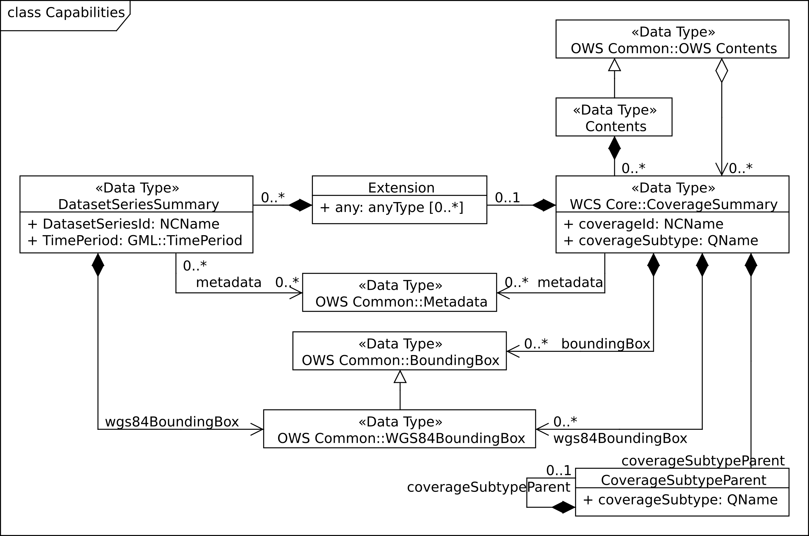
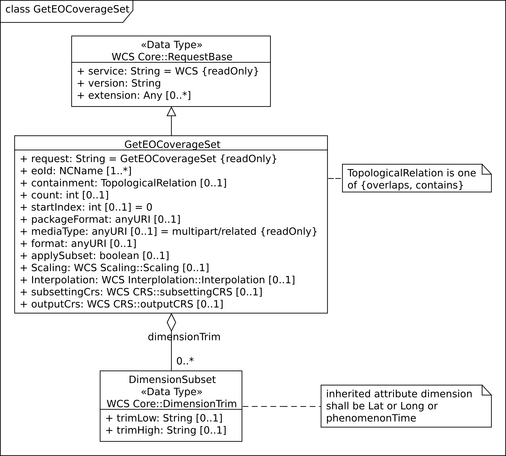

[#eo_service_model,reftext='7']
== EO service model

=== Overview

This Clause defines request types and their responses for operations on EO
Coverages. EO Coverages can be offered by a WCS server alongside with any other
type of coverage. Behavior of the service on non-EO Coverages remains
unchanged.

=== _GetCapabilities_ operation

==== _GetCapabilities_ request

The _GetCapabilities_ request is extended over WCS Core [OGC 09-110r4] as
follows:

* In the `sections` request parameter, values "DatasetSeriesSummary" and
"CoverageSummary" are allowed in addition to those defined in OWS Common
[06-121r9].

include::requirements/REQ033.adoc[]

==== _GetCapabilities_ response

The _GetCapabilities_ response is extended over WCS Core [OGC 09-110r4] as
follows:

* There is an additional `DatasetSeriesSummary` section reporting identifiers of
Dataset Series offered by the service on hand;

* There is an optional constraint `CountDefault` specifying the maximum number
of `CoverageDescription` and `DatasetSeriesDescription` elements reported in a
`DescribeEOCoverageSet` response; and

* For the _eowcs_geteocoverageset_ conformance class there is an additional
`<wcseo:wcseoMetadata` element inside the `wcs:Extension` element of
the `wcs:ServiceMetadata` element to specify default and supported package
formats for the _GetEOCoverageSet_ operation.

NOTE: An EO-WCS server may choose to not report, in the `CoverageSummary`
section of a _GetCapabilities_ response, the identifiers of Stitched Mosaic
coverages referred to by some Dataset Series and the identifiers of Dataset
coverages referred to by some Stitched Mosaic or Dataset Series.

In a _GetCapabilities_ response, a server announces availability of this EO-WCS
like an extension.

include::requirements/REQ034.adoc[]

include::requirements/REQ035.adoc[]

include::requirements/REQ036.adoc[]

[#response_getcapabilities,reftext='{figure-caption} {counter:figure-num}']
._GetCapabilities_ response UML class diagram

[#datasetseriessummary_components,reftext='{table-caption} {counter:table-num}']
.Components of `EOWCS::DatasetSeriesSummary` structure
[cols="2,3,2,^1",options="header"]
|===============================================================================
|Name                  |Definition                      |Data type |Multiplicity
|DatasetSeriesId |Identifier of a Dataset Series offered by this service
|`NCName` |one (mandatory)
|wgs84BoundingBox |Spatial extent of the Dataset Series
|`OWS Common::WGS84BoundingBox` |one (mandatory)
|TimePeriod |Time interval of validity of the Dataset Series |`GML:TimePeriod`
|one (mandatory)
|metadata |Reference to more metadata about this Dataset Series
|`OWS Common::Metadata` |zero or one (optional)
|===============================================================================

include::requirements/REQ037.adoc[]

include::requirements/REQ038.adoc[]

include::requirements/REQ039.adoc[]

The response shall respect the `sections` request parameter.

include::requirements/REQ040.adoc[]

include::requirements/REQ041.adoc[]

The coverage subtype shall indicate the specific type of the coverage returned, in case of an
EO Coverage.

include::requirements/REQ042.adoc[]

[#coveragesubtype_values,reftext='{table-caption} {counter:table-num}']
.Values for `CoverageSubtype` elements of EO Coverages
[cols="3,2",options="header"]
|===============================================================================
|Type of coverage identified by `CoverageIdentifier` |`CoverageSubtype` value
|`EOWCS::RectifiedDataset`                      |`RectifiedDataset`
|`EOWCS::ReferenceableDataset`                  |`ReferenceableDataset`
|`EOWCS::RectifiedStitchedMosaic`               |`RectifiedStitchedMosaic`
|`EOWCS::ReferenceableStitchedMosaic`           |`ReferenceableStitchedMosaic`
|===============================================================================

include::requirements/REQ043.adoc[]

[#contraint_values,reftext='{table-caption} {counter:table-num}']
.Values for `ows:Constraint` elements
[cols="1,3,1,1",options="header"]
|===============================================================================
|Name         |Definition                               |Data type |Multiplicity
|CountDefault |Default value for the count parameter defined for
_DescribeEOCoverageSet_ and _GetEOCoverageSet_ requests. |`Integer` greater
than or equal to zero |zero or one (optional)
|ImplementsResultPaging |Indicates if the server supports the ability to page
through a result set responding with `count` features at a time. |`Boolean`;
either `TRUE` or `FALSE` |zero or one (optional)
|===============================================================================

NOTE: Servers are strongly encouraged to specify a value for CountDefault as
means of self defense, so that a request may not clog the server.

include::requirements/REQ044.adoc[]

include::requirements/REQ045.adoc[]

include::requirements/REQ046.adoc[]

include::requirements/REQ047.adoc[]

Example: The following XML excerpt shows a possible `Contents` section
containing Dataset Series information:

[source,xml]
<wcs:Contents>
  <wcs:CoverageSummary>
    <wcs:CoverageId>someEOCoverage</wcs:CoverageId>
    <wcs:CoverageSubtype>RectifiedDataset</wcs:CoverageSubtype>
  </wcs:CoverageSummary>
  <wcs:Extension>
    <wcseo:DatasetSeriesSummary>
      <ows:WGS84BoundingBox>
        <ows:LowerCorner>-180 -90</ows:LowerCorner>
        <ows:UpperCorner>180 90</ows:UpperCorner>
        </ows:WGS84BoundingBox>
      <wcseo:DatasetSeriesId>someDatasetSeries</wcseo:DatasetSeriesId>
      <gml:TimePeriod gml:id="someDatasetSeries_timeperiod">
        <gml:beginPosition>2010-01-01T00:00:00.000</gml:beginPosition>
        <gml:endPosition>2010-12-31T23:59:59.999</gml:endPosition>
        </gml:TimePeriod>
      </wcseo:DatasetSeriesSummary>
  </wcs:Extension>
</wcs:Contents>

Example: The following XML excerpt shows a possible `Constraint` section
containing a CountDefault value:

[source,xml]
<ows:OperationsMetadata>
  ...
  <ows:Constraint name="CountDefault">
    <ows:NoValues />
    <ows:DefaultValue>100</ows:DefaultValue>
  </ows:Constraint>
  <ows:Constraint name="ImplementsResultPaging">
    <ows:NoValues/>
    <ows:DefaultValue>TRUE</ows:DefaultValue>
  </ows:Constraint>
</ows:OperationsMetadata>

Example: The following XML excerpt shows a possible `wcs:ServiceMetadata`
section containing valid `wcseo:packageFormatSupported` elements:

[source,xml]
<wcs:ServiceMetadata>
  <wcs:formatSupported>application/gml+xml</wcs:formatSupported>
  <wcs:formatSupported>image/tiff</wcs:formatSupported>
  <wcs:Extension>
    <wcseo:wcseoMetadata>
      <wcseo:defaultPackageFormat>application/metalink4+xml</wcseo:defaultPackageFormat>
      <wcseo:packageFormatSupported>application/x-gzip</wcseo:packageFormatSupported>
      <wcseo:packageFormatSupported>application/gzip</wcseo:packageFormatSupported>
      <wcseo:packageFormatSupported>application/bzip</wcseo:packageFormatSupported>
      <wcseo:packageFormatSupported>application/x-bzip</wcseo:packageFormatSupported>
      <wcseo:packageFormatSupported>application/tar</wcseo:packageFormatSupported>
      <wcseo:packageFormatSupported>application/x-tar</wcseo:packageFormatSupported>
      <wcseo:packageFormatSupported>application/zip</wcseo:packageFormatSupported>
      <wcseo:packageFormatSupported>application/metalink4+xml</wcseo:packageFormatSupported>
      <wcseo:packageFormatSupported>application/metalink+xml</wcseo:packageFormatSupported>
    </wcseo:wcseoMetadata>
  </wcs:Extension>
</wcs:ServiceMetadata>

=== _DescribeCoverage_ operation

==== _DescribeCoverage_ request

The _DescribeCoverage_ request is unchanged over WCS Core [OGC 09-110r4]. In
particular, identifiers of EO Coverages can be passed as input parameters.

NOTE: A DescribeCoverage request is possible on the identifiers of EO Coverages
offered by the server even if these are not listed in a GetCapabilities
response.

==== _DescribeCoverage_ response

In a _DescribeCoverage_ response, EO Coverage descriptions additionally contain
the EO Metadata record.

include::requirements/REQ048.adoc[]

The coverage subtype shall indicate the specific type of the coverage returned,
in case of an EO Coverage.

include::requirements/REQ049.adoc[]

Example: The following XML fragment shows parts of a possible DescribeCoverage
response on an EO Coverage:

[source,xml]
<wcs:CoverageDescriptions>
  <wcs:CoverageDescription gml:id="c1">
    <gml:boundedBy>
      <gml:Envelope axisLabels="lat long" srsDimension="2" srsName="http://www.opengis.net/def/crs/EPSG/0/4326" uomLabels="deg deg">
        <gml:lowerCorner>42.862778 1.896944</gml:lowerCorner>
        <gml:upperCorner>43.516667 2.861667</gml:upperCorner>
      </gml:Envelope>
    </gml:boundedBy>
    <wcs:CoverageId>c1</wcs:CoverageId>
    <gmlcov:metadata>
      <gmlcov:Extension>
        <wcseo:EOMetadata>
          <eop:EarthObservation gml:id="eop_c1">
            <om:phenomenonTime>
              <gml:TimePeriod gml:id="tp_c1">
                <gml:beginPosition>2008-03-13T10:00:06.000</gml:beginPosition>
                <gml:endPosition>2008-03-13T10:20:26.000</gml:endPosition>
              </gml:TimePeriod>
            </om:phenomenonTime>
            <om:resultTime>
              <gml:TimeInstant gml:id="archivingdate_c1">
              <gmlcovl:timePosition>2001-08-13T11:02:47.999</gml:timePosition>
              </gml:TimeInstant>
            </om:resultTime>
            <om:procedure />
            <om:observedProperty />
            <om:featureOfInterest>
              <eop:Footprint gml:id="footprint_c1">
                <eop:multiExtentOf>
                  <gml:MultiSurface gml:id="multisurface_c1" srsName="EPSG:4326">
                    <gml:surfaceMember>
                      <gml:Polygon gml:id="polygon_c1">
                        <gml:exterior>
                          <gml:LinearRing>
                            <gml:posList>
                              43.516667 2.1025 43.381667 2.861667
                              42.862778 2.65 42.996389 1.896944
                              43.516667 2.1025
                            </gml:posList>
                          </gml:LinearRing>
                        </gml:exterior>
                      </gml:Polygon>
                    </gml:surfaceMember>
                  </gml:MultiSurface>
                </eop:multiExtentOf>
                <eop:centerOf>
                  <gml:Point gml:id="c1_p" srsName="EPSG:4326">
                    <gml:pos>43.190833 2.374167</gml:pos>
                  </gml:Point>
                </eop:centerOf>
              </eop:Footprint>
            </om:featureOfInterest>
            <om:result />
            <eop:metaDataProperty>
              <eop:EarthObservationMetaData>
              <eop:identifier>c1</eop:identifier>
              <eop:acquisitionType>NOMINAL</eop:acquisitionType>
              <eop:status>ARCHIVED</eop:status>
              </eop:EarthObservationMetaData>
            </eop:metaDataProperty>
          </eop:EarthObservation>
        </wcseo:EOMetadata>
      </gmlcov:Extension>
    </gmlcov:metadata>
    <gml:domainSet>
      <gml:RectifiedGrid dimension="2" gml:id="c1_grid">
        ...
      </gml:RectifiedGrid>
    </gml:domainSet>
    <gmlcov:rangeType>
      ...
    </gmlcov:rangeType>
    <wcs:ServiceParameters>
      <wcs:CoverageSubtype>RectifiedDataset</wcs:CoverageSubtype>
      <wcs:nativeFormat>image/tiff</wcs:nativeFormat>
    </wcs:ServiceParameters>
  </wcs:CoverageDescription>
</wcs:CoverageDescriptions>

NOTE: The complete example is provided with the schema files being part of this
standard.

=== _GetCoverage_ operation

==== _GetCoverage_ request

The _GetCoverage_ request is unchanged over WCS Core [OGC 09-110r4], except that
for EO Coverages slicing is disallowed as it would leave the EO Metadata
undefined.

NOTE: A _GetCoverage_ request is possible on the identifiers of EO Coverages
offered by the server even if these are not listed in a _GetCapabilities_
response.

include::requirements/REQ050.adoc[]

[[getcoverage_response]]
==== _GetCoverage_ response

The _GetCoverage_ response is as defined in the WCS Core [OGC 09-110r4], however
extended in two respects:

* The coverage returned contains exactly one metadata element holding the EO
Metadata record (it may contain further metadata elements in addition); and

* The lineage component of the EO Metadata record returned consists of the
preexisting lineage sequence plus one element appended which describes the
_GetCoverage_ request on hand.

NOTE: As always, whether all these elements will be available to a client
depends on the degree of support for the information items by the requested
coverage encoding.

On EO Coverages, a _GetCoverage_ request shall produce a coverage of the type
corresponding to the coverage inspected.

include::requirements/REQ051.adoc[]

The EO Metadata, including the extended lineage record, shall be delivered
alongside with the coverage data, adjusted according to the operations executed
during _GetCoverage_ evaluation.

include::requirements/REQ052.adoc[]

include::requirements/REQ053.adoc[]

include::requirements/REQ054.adoc[]

The lineage record shall be extended by a reproducible description of the
_GetCoverage_ request originating this output.

include::requirements/REQ055.adoc[]

NOTE: This content is dependent on the protocol used by the requester. In case
of a GET/KVP request, this will be the request URL with parameters. In case of
an XML or SOAP request this will be an XML snippet.

Example: The following XML fragment shows parts of a possible GetCoverage
response for an EO Coverage:

[source,xml]
<wcseo:RectifiedDataset xmlns:ows="http://www.opengis.net/ows/2.0"
xmlns:gml="http://www.opengis.net/gml/3.2"
xmlns:gmlcov="http://www.opengis.net/gmlcov/1.0"
xmlns:swe="http://www.opengis.net/swe/2.0"
xmlns:wcs="http://www.opengis.net/wcs/2.0"
xmlns:wcseo="http://www.opengis.net/wcs/wcseo/1.1"
xmlns:eop="http://www.opengis.net/eop/2.1"
xmlns:om="http://www.opengis.net/om/2.0"
xmlns:xlink="http://www.w3.org/1999/xlink"
xmlns:xsi="http://www.w3.org/2001/XMLSchema-instance"
xsi:schemaLocation="http://www.opengis.net/wcs/wcseo/1.1
http://schemas.opengis.net/wcs/wcseo/1.1/wcsEOGetCoverage.xsd" gml:id="c1">
  <gml:boundedBy>
    ...
  </gml:boundedBy>
  <gml:domainSet>
    ...
  </gml:domainSet>
  <gml:rangeSet>
    ...
  </gml:rangeSet>
  <gmlcov:rangeType>
    ...
  </gmlcov:rangeType>
  <gmlcov:metadata>
    <gmlcov:Extension>
      <wcseo:EOMetadata>
        <eop:EarthObservation gml:id="eop_c1">
          <om:phenomenonTime>
            <gml:TimePeriod gml:id="tp_c1">
              <gml:beginPosition>2008-03-13T10:00:06.000</gml:beginPosition>
              <gml:endPosition>2008-03-13T10:20:26.000</gml:endPosition>
            </gml:TimePeriod>
          </om:phenomenonTime>
          <om:resultTime>
            <gml:TimeInstant gml:id="archivingdate_c1">
              <gml:timePosition>2008-03-13T11:02:47.999</gml:timePosition>
            </gml:TimeInstant>
          </om:resultTime>
          <om:procedure>
            ...
          </om:procedure>
          <om:observedProperty />
          <om:featureOfInterest>
            ...
          </om:featureOfInterest>
          <om:result>
            ...
          </om:result>
          <eop:metaDataProperty>
            ...
          /eop:metaDataProperty>
        </eop:EarthObservation>
        <wcseo:lineage>
          <!-- GetCoverage request via KVP -->
          <wcseo:referenceGetCoverage>
            <ows:Reference xlink:href="http://www.someWCS.org?SERVICE=WCS&amp;VERSION=2.0.1&amp;REQUEST=GetCoverage&amp;COVERAGEID=c1&amp;FORMAT=application/gml+xml&amp;MEDIATYPE=multipart/related" />
          </wcseo:referenceGetCoverage>
          <gml:timePosition>2011-02-04T15:45:52Z</gml:timePosition>
        </wcseo:lineage>
        <wcseo:lineage>
          <!-- GetCoverage request via POST -->
          <wcseo:referenceGetCoverage>
            <ows:ServiceReference xlink:href="http://www.someWCS.org">
              <ows:RequestMessage>
                <wcs:GetCoverage xmlns:wcs="http://www.opengis.net/wcs/2.0" xmlns:gml="http://www.opengis.net/gml/3.2" xmlns:xsi="http://www.w3.org/2001/XMLSchema-instance" xsi:schemaLocation="http://www.opengis.net/wcs/2.0 http://schemas.opengis.net/wcs/2.0/wcsAll.xsd" service="WCS" version="2.0.1">
                  <wcs:CoverageId>c1</wcs:CoverageId>
                  <wcs:format>application/gml+xml</wcs:format>
                  <wcs:mediaType>multipart/related</wcs:mediaType>
                </wcs:GetCoverage>
                </ows:RequestMessage>
              </ows:ServiceReference>
            </wcseo:referenceGetCoverage>
          <gml:timePosition>2011-02-04T15:45:52Z</gml:timePosition>
        </wcseo:lineage>
      </wcseo:EOMetadata>
    </gmlcov:Extension>
  </gmlcov:metadata>
</wcseo:RectifiedDataset>

=== _DescribeEOCoverageSet_ operation

==== Overview

A _DescribeEOCoverageSet_ request submits one or more Dataset Series, Stitched
Mosaic, or Dataset identifiers together with a spatio-temporal subsetting
criterion ("bounding box"). The spatial constraint is expressed in WGS84
<<b4>>, the temporal constraint in ISO 8601 <<b2>>.

The response to a successful request on a Dataset Series consists of a (possibly
empty) set of descriptions of Datasets and Stitched Mosaics and a (possibly
empty) set of descriptions of Dataset Series. The response to a successful
request on a Stitched Mosaic consists of a (possibly empty) set of descriptions
of Datasets. In any case, the result items are those ones which are (i) referred
to directly or via Dataset Series by the object submitted and (ii) matched by
the bounding box. The type of matching - `contains` or `overlaps` - is specified
in the request.

==== _DescribeEOCoverageSet_ request

include::requirements/REQ056.adoc[]

[#request_describeeocoverageset,reftext='{figure-caption} {counter:figure-num}']
._DescribeEOCoverageSet_ request UML diagram

[#describeeocoverageset_comp,reftext='{table-caption} {counter:table-num}']
.Components of `DescribeEOCoverageSet` operation request
[cols="2,3,2,^1",options="header"]
|===============================================================================
|Name                  |Definition                      |Data type |Multiplicity
|`request` |Request name |`String` , fixed to "DescribeEOCoverageSet" |one
(mandatory)
|`eoId` |Identifier of Dataset Series, Stitched Mosaic, or Dataset to be
evaluated |`NCName` |one or more (mandatory)
|`containment` |Intersection mode for evaluation of object bounding box against
request parameters |`String` |zero or one (optional)
|`count` |Maximum number of `CoverageDescription` and `DatasetSeriesDescription`
elements to be included in the response |`Integer` greater than zero |zero or
one (optional)
|`startIndex` |Index number within the result set from which the server shall
begin presenting results in the response (the index number of the first search
result is 0) |`Integer` greater than or equal to zero. Default `0` |zero or one
(optional)
|`sections` |Unordered list of zero or more names of the XML elements that shall
be returned |`String` |zero or one (optional)
|`dimensionTrim` |trim specification, as per WCS Core [OGC 09-110r4] Subclause
8.4.1 |`WCS::DimensionTrim` |zero or more (optional)
|===============================================================================

The _DescribeEOCoverageSet_ request type contains two sections (cf. [OGC
06-121r9] Clause 7.3.3) whose appearance in the response can be controlled by
the client through the optional `sections` parameter.

include::requirements/REQ057.adoc[]

NOTE: This use of the sections parameter is similar to its use in
_GetCapabilities_ as defined in OWS Common [OGC 06-121r9].

include::requirements/REQ058.adoc[]

NOTE: A _DescribeEOCoverageSet_ request is possible on the identifiers of
objects offered by the server even if these are not listed in a GetCapabilities
response.

include::requirements/REQ059.adoc[]

include::requirements/REQ060.adoc[]

include::requirements/REQ061.adoc[]

NOTE: Trim coordinates are not required to lie within the boundaries of the EO
Coverage inquired.

Example: The following XML instance shows a possible _DescribeEOCoverageSet_
operation request:

[source,xml]
<wcseo:DescribeEOCoverageSet xmlns:wcseo="http://www.opengis.net/wcs/wcseo/1.1" xmlns:wcs="http://www.opengis.net/wcs/2.0" xmlns:xsi="http://www.w3.org/2001/XMLSchema-instance" xsi:schemaLocation="http://www.opengis.net/wcs/wcseo/1.1 http://schemas.opengis.net/wcs/wcseo/1.1/wcsEOAll.xsd" service="WCS" version="2.0.1" count="100" startIndex="0">
  <wcseo:eoId>DS1</wcseo:eoId>
  <wcseo:containment>overlaps</wcseo:containment>
  <wcseo:sections>
    <wcseo:section>All</wcseo:section>
  </wcseo:sections>
  <wcs:DimensionTrim>
    <wcs:Dimension>long</wcs:Dimension>
    <wcs:TrimLow>16</wcs:TrimLow>
    <wcs:TrimHigh>18</wcs:TrimHigh>
  </wcs:DimensionTrim>
  <wcs:DimensionTrim>
    <wcs:Dimension>lat</wcs:Dimension>
    <wcs:TrimLow>40</wcs:TrimLow>
    <wcs:TrimHigh>42</wcs:TrimHigh>
  </wcs:DimensionTrim>
  <wcs:DimensionTrim>
    <wcs:Dimension>phenomenonTime</wcs:Dimension>
    <wcs:TrimLow>2008-03-13T10:10:00Z</wcs:TrimLow>
    <wcs:TrimHigh>2008-03-13T10:11:00Z</wcs:TrimHigh>
  </wcs:DimensionTrim>
</wcseo:DescribeEOCoverageSet>

==== _DescribeEOCoverageSet_ response

The response to a successful _DescribeEOCoverageSet_ request consists of a
(possibly empty) set of EO Coverage descriptions and a (possibly empty) set of
Dataset Series descriptions (cf. <<resp_describeeocoverageset>>).

include::requirements/REQ062.adoc[]

[#eocoveragesetdescription_comp,reftext='{table-caption} {counter:table-num}']
.Components of `EOCoverageSetDescription` structure
[cols="2,3,2,^1",options="header"]
|===============================================================================
|Name                  |Definition                      |Data type |Multiplicity
|`datasetSeriesDescriptions` |Unordered sequence of DatasetSeries descriptions
|`DatasetSeriesDescriptions` |zero or one (optional)
|`coverageDescriptions` |Unordered sequence of coverage descriptions
|`WCS::CoverageDescriptions` |zero or one (optional)
|===============================================================================

[#resp_describeeocoverageset,reftext='{figure-caption} {counter:figure-num}']
._DescribeEOCoverageSet_ response UML diagram

include::requirements/REQ063.adoc[]

The response shall respect the `sections` request parameter.

include::requirements/REQ064.adoc[]

include::requirements/REQ065.adoc[]

Such a response contains only EO Coverages directly referred to by the object(s)
addressed in the request or via referred Dataset Series.

include::requirements/REQ066.adoc[]

include::requirements/REQ067.adoc[]

NOTE: A Dataset referred to by a Dataset Series referred to by another Dataset
Series is implicitly referred to by the later Dataset Series and thus always
reported by a _DescribeEOCoverageSet_ request against the later Dataset Series.
However, it is allowed that such a Dataset is also referred to by the first
Dataset Series but it is only reported once.

NOTE: A Dataset referred to by a Stitched Mosaic referred to by a Dataset Series
is not per se referred to by that Dataset Series and thus not reported by a
_DescribeEOCoverageSet_ request against the Dataset Series. However, it is allowed
that such a Dataset is also referred to by the enclosing Dataset Series.

Spatial subsetting is evaluated against the `eop:Footprint` element contained in
the `EOMetadata` element of an EO Coverage.

include::requirements/REQ068.adoc[]

Temporal subsetting is evaluated against the temporal validity of an EO
Coverage.

include::requirements/REQ069.adoc[]

Boundary values omitted are substituted by the actual boundary value of the
object inquired.

include::requirements/REQ070.adoc[]

include::requirements/REQ071.adoc[]

NOTE: This trim semantics is analogous to trimming in _GetCoverage_.

include::requirements/REQ072.adoc[]

include::requirements/REQ073.adoc[]

NOTE: The `count` parameter is used in the same ways as the `itemsPerPage`
element in the OpenSearch Specification <<b7>>.

include::requirements/REQ074.adoc[]

NOTE: A server is assumed to apply a consistent ordering to the result set.

include::requirements/REQ075.adoc[]

include::requirements/REQ076.adoc[]

include::requirements/REQ077.adoc[]

include::requirements/REQ078.adoc[]

include::requirements/REQ079.adoc[]

NOTE: The specific format of the next and previous URIs is implementation
dependent as are the details of how or if the server caches the results of an
operation in order to be able to present them to the client one subset at a
time.

NOTE: The `count`, `startIndex`, `next`, and `previous` parameters used for
paging are defined in the same way as in the OpenGIS Web Feature Service 2.0
Interface Standard <<b8>>.

Example: The following XML fragment shows parts of a possible
`DescribeEOCoverageSet` operation response:

[source,xml]
<wcseo:EOCoverageSetDescription numberMatched="2" numberReturned="2" startIndex="0">
  <wcs:CoverageDescriptions>
    <wcs:CoverageDescription gml:id="c1">
      <gml:boundedBy>
        ...
      </gml:boundedBy>
      <wcs:CoverageId>c1</wcs:CoverageId>
      <gmlcov:metadata>
        <gmlcov:Extension>
          <wcseo:EOMetadata>
            <eop:EarthObservation gml:id="c1_metadata">
              ...
            </eop:EarthObservation>
          </wcseo:EOMetadata>
        </gmlcov:Extension>
      </gmlcov:metadata>
      <gml:domainSet>
        ...
      </gml:domainSet>
      <gmlcov:rangeType>
        ...
      </gmlcov:rangeType>
      <wcs:ServiceParameters>
        <wcs:CoverageSubtype>RectifiedStitchedMosaic</wcs:CoverageSubtype>
        <wcseo:dataset>
          <wcs:CoverageId>c3</wcs:CoverageId>
        </wcseo:dataset>
      </wcs:ServiceParameters>
    </wcs:CoverageDescription>
  </wcs:CoverageDescriptions>
  <wcseo:DatasetSeriesDescriptions>
    <wcseo:DatasetSeriesDescription gml:id="ds2">
      <gml:boundedBy>
        <gml:Envelope axisLabels="lat long" srsDimension="2" srsName="http://www.opengis.net/def/crs/EPSG/0/4326" uomLabels="deg deg">
          <gml:lowerCorner>46 16</gml:lowerCorner>
          <gml:upperCorner>48 18</gml:upperCorner>
        </gml:Envelope>
      </gml:boundedBy>
      <wcseo:DatasetSeriesId>ds2</wcseo:DatasetSeriesId>
      <gml:TimePeriod gml:id="ds2_timeperiod">
        <gml:beginPosition>2010-01-01T00:00:00.000</gml:beginPosition>
        <gml:endPosition>2010-12-31T23:59:59.999</gml:endPosition>
      </gml:TimePeriod>
    </wcseo:DatasetSeriesDescription>
  </wcseo:DatasetSeriesDescriptions>
</wcseo:EOCoverageSetDescription>

==== _DescribeEOCoverageSet_ exceptions

[#describeeocoverageset_except,reftext='{table-caption} {counter:table-num}']
.Exception codes for DescribeEOCoverageSet operation
[cols="2,^1,3,2",options="header"]
|===============================================================================
|`exceptionCode` value |HTTP code | Meaning of exception code |`locator` value
|`NoSuchDatasetSeriesOrCoverage` |404 |The identifier passed does not match with
any of the DatasetSeries or EO Coverages offered by this server |List of
violating Dataset Series and/or EO Coverage identifiers
|===============================================================================

[[geteocoverageset_operation,7.6]]
=== _GetEOCoverageSet_ operation

==== Overview

Just like the _DescribeEOCoverageSet_ request, a _GetEOCoverageSet_ request
submits one or more Dataset Series, Stitched Mosaic, or Dataset identifiers
together with a spatio-temporal subsetting criterion ("bounding box"). By
default, the spatial constraint is expressed in WGS84 <<b4>>, the temporal
constraint in ISO 8601 <<b2>>.

Additionally, the _GetEOCoverageSet_ request allows to submit simple processing
like scaling, interpolation, output CRS, format, and actually applying the
subsetting.

The response to a successful request on a Dataset Series consists of a (possibly
empty) set of coverages of Datasets and Stitched Mosaics. The response to a
successful request on a Stitched Mosaic consists of a (possibly empty) set of
coverages of Datasets. In any case, the result items are those ones which are
(i) referred to directly or via Dataset Series by the object submitted and (ii)
matched by the bounding box. The type of matching - `contains` or `overlaps` -
is specified in the request.

NOTE: Using the _GetEOCoverageSet_ operation allows to retrieve entire or
subsetted coverages in their native or any given format with limited processing
like subsetting or scaling applied. To request advanced processing the
_GetCoverage_ operation may be used.

==== _GetEOCoverageSet_ request

include::requirements/REQ080.adoc[]

[#request_geteocoverageset,reftext='{figure-caption} {counter:figure-num}']
._GetEOCoverageSet_ request UML diagram

[#geteocoverageset_comp,reftext='{table-caption} {counter:table-num}']
.Components of `GetEOCoverageSet` operation request
[cols="2,3,2,^1",options="header"]
|===============================================================================
|Name                  |Definition                      |Data type |Multiplicity
|`request` |Request name |`String` , fixed to "GetEOCoverageSet" |one
(mandatory)
|`eoId` |Identifier of Dataset Series, Stitched Mosaic, or Dataset to be
evaluated |`NCName` |one or more (mandatory)
|`containment` |Intersection mode for evaluation of object bounding box against
request parameters |`String` |zero or one (optional)
|`count` |Maximum number of `WCS::Coverage` elements to be included in the
response |`Integer` greater than zero |zero or one (optional)
|`startIndex` |Index number within the result set from which the server shall
begin presenting results in the response (the index number of the first search
result is 0) |`Integer` greater than or equal to zero. Default `0` |zero or one
(optional)
|`dimensionTrim` |trim specification, as per WCS Core [OGC 09-110r4] Subclause
8.4.1 |`WCS::DimensionTrim` |zero or more (optional)
|`packageFormat` |MIME type identifier of the format in which the coverages
returned are to be packaged e.g., `application/x-gzip` |`anyURI` |zero or one
(optional)
|`mediaType` |If present, enforces a multipart encoding |`anyURI`, fixed to
\"``multipart/related``" |zero or one (optional)
|`format` |MIME type identifier of the format in which the coverages returned are
to be encoded |`anyURI` |zero or one (optional)
|`applySubset` |Determining if the given subset should be applied to the
coverages returned |`boolean` |zero or one (optional)
|`Scaling` |Scaling to be applied to coverages returned |`scal:Scaling` |zero
or one (optional)
|`Interpolation` |Interpolation method to be applied on all axes during
_GetEOCoverageSet_ result preparation |`int:Interpolation` |zero or one
(optional)
|`subsettingCrs` |CRS Identifier indicating the CRS in which the request
subsetting coordinates are expressed |`crs:subsettingCrs` |zero or one
(optional)
|`outputCrs` |CRS Identifier indicating the CRS of the result coverages
|`crs:outputCrs` |zero or one (optional)
|===============================================================================

include::requirements/REQ081.adoc[]

NOTE: A _GetEOCoverageSet_ request is possible on the identifiers of
objects offered by the server even if these are not listed in a GetCapabilities
response.

include::requirements/REQ082.adoc[]

The subsetting is interpreted similar to the _DescribeEOCoverageSet_ operation.
In addition alternative subsetting is allowed using the `subsettingCrs`
parameter as defined by the WCS CRS Extension [OGC 11-053r1].

include::requirements/REQ083.adoc[]

include::requirements/REQ084.adoc[]

NOTE: Trim coordinates are not required to lie within the boundaries of the EO
Coverage inquired.

The package encoding format in which the coverages are returned is specified
by the combination of the `packageFormat` and `mediaType` parameters. Admissible
values (i.e, package formats supported) are those listed in the server's
Capabilities document. The default is the also reported in the server's
Capabilities document.

include::requirements/REQ085.adoc[]

include::requirements/REQ086.adoc[]

The encoding format in which the coverages themselves are returned is specified
by the `format` parameter. Admissible values (i.e, formats supported) are those
listed in the server's Capabilities document. Note that only one format
applicable for all coverages to be returned can be specified. Default is the
coverage's Native Format of each coverage to be returned.

include::requirements/REQ087.adoc[]

A general scaling and interpolation can be requested that is equally applied to
all coverages returned.

include::requirements/REQ088.adoc[]

include::requirements/REQ089.adoc[]

A general output CRS as well as CRS for subsetting can be requested that is
equally applied to all coverages returned.

include::requirements/REQ090.adoc[]

Example: The following XML instance shows a possible _GetEOCoverageSet_
operation request:

[source,xml]
<?xml version="1.0" encoding="UTF-8"?>
<wcseo:GetEOCoverageSet xmlns:wcseo="http://www.opengis.net/wcs/wcseo/1.1" xmlns:wcs="http://www.opengis.net/wcs/2.0" xmlns:int="http://www.opengis.net/wcs/interpolation/1.0" xmlns:scal="http://www.opengis.net/wcs/scaling/1.0" xmlns:crs="http://www.opengis.net/wcs/crs/1.0" xmlns:xsi="http://www.w3.org/2001/XMLSchema-instance" xsi:schemaLocation="http://www.opengis.net/wcs/wcseo/1.1 http://schemas.opengis.net/wcs/wcseo/1.1/wcsEOAll.xsd" service="WCS" version="2.0.1" count="100" startIndex="0">
  <wcseo:eoId>someDatasetSeries1</wcseo:eoId>
  <wcseo:containment>OVERLAPS</wcseo:containment>
  <wcs:DimensionTrim>
    <wcs:Dimension>long</wcs:Dimension>
    <wcs:TrimLow>16</wcs:TrimLow>
    <wcs:TrimHigh>18</wcs:TrimHigh>
  </wcs:DimensionTrim>
  <wcs:DimensionTrim>
    <wcs:Dimension>lat</wcs:Dimension>
    <wcs:TrimLow>40</wcs:TrimLow>
    <wcs:TrimHigh>42</wcs:TrimHigh>
  </wcs:DimensionTrim>
  <wcs:DimensionTrim>
    <wcs:Dimension>phenomenonTime</wcs:Dimension>
    <wcs:TrimLow>2008-03-13T10:10:00Z</wcs:TrimLow>
    <wcs:TrimHigh>2008-03-13T10:11:00Z</wcs:TrimHigh>
  </wcs:DimensionTrim>
  <wcseo:packageFormat>application/x-gzip</wcseo:packageFormat>
  <wcseo:mediaType>multipart/related</wcseo:mediaType>
  <wcseo:format>image/tiff</wcseo:format>
  <wcseo:applySubset>true</wcseo:applySubset>
  <int:Interpolation>
    <int:globalInterpolation>http://www.opengis.net/def/interpolation/OGC/1/nearest-neighbor</int:globalInterpolation>
  </int:Interpolation>
  <scal:Scaling>
    <scal:ScaleByFactor>
      <scal:scaleFactor>2.0</scal:scaleFactor>
    </scal:ScaleByFactor>
  </scal:Scaling>
  <wcscrs:subsettingCrs>http://www.opengis.net/def/crs/EPSG/0/4326</wcscrs:subsettingCrs>
  <wcscrs:outputCrs>http://www.opengis.net/def/crs/EPSG/0/4326</wcscrs:outputCrs>
</wcseo:GetEOCoverageSet>

==== _GetEOCoverageSet_ response

The response to a successful _GetEOCoverageSet_ request consists of a (possibly
empty) packaged set of EO Coverages. Each individual coverage itself is
structured the same way as resulting from a _GetCoverage_ request.

include::requirements/REQ091.adoc[]

include::requirements/REQ092.adoc[]

include::requirements/REQ093.adoc[]

include::requirements/REQ094.adoc[]

NOTE: The usage of `cid` is defined in [OGC 09-146r2].

include::requirements/REQ095.adoc[]

The requirements defined for the _GetCoverage_ response like containing EO
Metadata or adding a lineage component apply to each EO Coverage included in a
_GetEOCoverageSet_ response package.

include::requirements/REQ096.adoc[]

A _GetEOCoverageSet_ response contains only EO Coverages directly referred to by
the object(s) addressed in the request or via referred Dataset Series.

include::requirements/REQ097.adoc[]

include::requirements/REQ098.adoc[]

NOTE: A Dataset referred to by a Dataset Series referred to by another Dataset
Series is implicitly referred to by the later Dataset Series and thus always
reported by a _GetEOCoverageSet_ request against the later Dataset Series.
However, it is allowed that such a Dataset is also referred to by the first
Dataset Series but it is only reported once.

NOTE: A Dataset referred to by a Stitched Mosaic referred to by a Dataset Series
is not per se referred to by that Dataset Series and thus not reported by a
_GetEOCoverageSet_ request against the Dataset Series. However, it is allowed
that such a Dataset is also referred to by the enclosing Dataset Series.

Spatial subsetting is evaluated against the `eop:Footprint` element contained in
the `EOMetadata` element of an EO Coverage.

include::requirements/REQ099.adoc[]

Temporal subsetting is evaluated against the temporal validity of an EO
Coverage.

include::requirements/REQ100.adoc[]

Boundary values omitted are substituted by the actual boundary value of the
object inquired.

include::requirements/REQ101.adoc[]

include::requirements/REQ102.adoc[]

NOTE: This trim semantics is analogous to trimming in _GetCoverage_.

include::requirements/REQ103.adoc[]

NOTE: The `count` parameter is used in the same ways as the `itemsPerPage`
element in the OpenSearch Specification <<b7>>.

include::requirements/REQ104.adoc[]

NOTE: A server is assumed to apply a consistent ordering to the result set.

include::requirements/REQ105.adoc[]

include::requirements/REQ106.adoc[]

include::requirements/REQ107.adoc[]

include::requirements/REQ108.adoc[]

include::requirements/REQ109.adoc[]

NOTE: The specific format of the next and previous URIs is implementation
dependent as are the details of how or if the server caches the results of an
operation in order to be able to present them to the client one subset at a
time.

NOTE: The `count`, `startIndex`, `next`, and `previous` parameters used for
paging are defined in the same way as in the OpenGIS Web Feature Service 2.0
Interface Standard <<b8>>.

The spatial subsetting requested may be applied to the EO Coverages to be
returned. Default is to respond with entire coverages.

include::requirements/REQ110.adoc[]

A requested general scaling and interpolation is equally applied to all
coverages returned.

include::requirements/REQ111.adoc[]

include::requirements/REQ112.adoc[]

A requested general output CRS as well as CRS for subsetting is equally applied
to all coverages returned.

include::requirements/REQ113.adoc[]

Example: The following XML fragment shows parts of the first part of a possible
`GetEOCoverageSet` operation multipart response:

[source,xml]
<?xml version="1.0" encoding="UTF-8"?>
<wcseo:EOCoverageSet numberMatched="3" numberReturned="3" startIndex="0" xmlns:ows="http://www.opengis.net/ows/2.0" xmlns:gml="http://www.opengis.net/gml/3.2" xmlns:gmlcov="http://www.opengis.net/gmlcov/1.0" xmlns:swe="http://www.opengis.net/swe/2.0" xmlns:wcs="http://www.opengis.net/wcs/2.0" xmlns:wcseo="http://www.opengis.net/wcs/wcseo/1.1" xmlns:eop="http://www.opengis.net/eop/2.1" xmlns:om="http://www.opengis.net/om/2.0" xmlns:xlink="http://www.w3.org/1999/xlink" xmlns:xsi="http://www.w3.org/2001/XMLSchema-instance" xsi:schemaLocation="http://www.opengis.net/wcs/wcseo/1.1 http://schemas.opengis.net/wcs/wcseo/1.1/wcsEOAll.xsd">
  <wcseo:RectifiedDataset gml:id="someEOCoverage1">
    <gml:boundedBy>
      ...
    </gml:boundedBy>
    <gml:domainSet>
      ...
    </gml:domainSet>
    <gml:rangeSet>
      <gml:File>
        <gml:rangeParameters xlink:arcrole="fileReference" xlink:href="cid:coverages.meta4;someEOCoverage1.tif" xlink:role="http://www.opengis.net/spec/GMLCOV_geotiff-coverages/1.0/conf/geotiff-coverage" />
        <gml:fileReference>cid:coverages.meta4;someEOCoverage1.tif</gml:fileReference>
        <gml:fileStructure />
        <gml:mimeType>image/tiff</gml:mimeType>
      </gml:File>
    </gml:rangeSet>
    <gmlcov:rangeType>
      ...
    </gmlcov:rangeType>
    <gmlcov:metadata>
      <gmlcov:Extension>
        <wcseo:EOMetadata>
          <eop:EarthObservation gml:id="eop_someEOCoverage1">
            ...
          </eop:EarthObservation>
          <wcseo:lineage>
            <wcseo:referenceGetEOCoverageSet>
              <ows:Reference xlink:href="http://www.someWCS.org?SERVICE=WCS&amp;VERSION=2.0.1&amp;REQUEST=GetEOCoverageSet&amp;EOID=someDatasetSeries1&amp;PACKAGEFORMAT=application/metalink4+xml&amp;MEDIATYPE=multipart/related" />
            </wcseo:referenceGetEOCoverageSet>
            <gml:timePosition>2016-05-17T12:25:40Z</gml:timePosition>
          </wcseo:lineage>
        </wcseo:EOMetadata>
      </gmlcov:Extension>
    </gmlcov:metadata>
  </wcseo:RectifiedDataset>
  <wcseo:RectifiedDataset gml:id="someEOCoverage2">
    <gml:boundedBy>
      ...
    </gml:boundedBy>
    <gml:domainSet>
      ...
    </gml:domainSet>
    <gml:rangeSet>
      <gml:File>
        <gml:rangeParameters xlink:arcrole="fileReference" xlink:href="cid:coverages.meta4;someEOCoverage2.tif" xlink:role="http://www.opengis.net/spec/GMLCOV_geotiff-coverages/1.0/conf/geotiff-coverage" />
        <gml:fileReference>cid:coverages.meta4;someEOCoverage2.tif</gml:fileReference>
        <gml:fileStructure />
        <gml:mimeType>image/tiff</gml:mimeType>
      </gml:File>
    </gml:rangeSet>
    <gmlcov:rangeType>
      ...
    </gmlcov:rangeType>
    <gmlcov:metadata>
      <gmlcov:Extension>
        <wcseo:EOMetadata>
          <eop:EarthObservation gml:id="eop_someEOCoverage2">
            ...
          </eop:EarthObservation>
          <wcseo:lineage>
            <wcseo:referenceGetEOCoverageSet>
              <ows:Reference xlink:href="http://www.someWCS.org?SERVICE=WCS&amp;VERSION=2.0.1&amp;REQUEST=GetEOCoverageSet&amp;EOID=someDatasetSeries1&amp;PACKAGEFORMAT=application/metalink4+xml&amp;MEDIATYPE=multipart/related" />
            </wcseo:referenceGetEOCoverageSet>
            <gml:timePosition>2016-05-17T12:25:40Z</gml:timePosition>
          </wcseo:lineage>
        </wcseo:EOMetadata>
      </gmlcov:Extension>
    </gmlcov:metadata>
  </wcseo:RectifiedDataset>
  <wcseo:DatasetSeries>
    <wcseo:DatasetSeriesId>someDatasetSeries1</wcseo:DatasetSeriesId>
    <eop:Footprint gml:id="footprint_someDatasetSeries1">
      ...
    </eop:Footprint>
    <gml:TimePeriod gml:id="someDatasetSeries1_timeperiod">
      ...
    </gml:TimePeriod>
    <ows:Metadata>
      <wcseo:EOMetadata>
        <ows:Reference xlink:href="http://www.someCatalogue.org/eop-metadata-from-someDatasetSeries1" xlink:role="http://standards.iso.org/iso/19115/-3/mdb/1.0" xlink:title="ISO 19115-3 Metadata" />
        <wcseo:lineage>
          <wcseo:referenceGetEOCoverageSet>
            <ows:Reference xlink:href="http://www.someWCS.org?SERVICE=WCS&amp;VERSION=2.0.1&amp;REQUEST=GetEOCoverageSet&amp;EOID=someDatasetSeries1&amp;PACKAGEFORMAT=application/metalink4+xml&amp;MEDIATYPE=multipart/related" />
          </wcseo:referenceGetEOCoverageSet>
          <gml:timePosition>2016-05-17T12:25:40Z</gml:timePosition>
        </wcseo:lineage>
      </wcseo:EOMetadata>
    </ows:Metadata>
    <wcseo:rectifiedDataset>
      <wcs:CoverageId>someEOCoverage1</wcs:CoverageId>
    </wcseo:rectifiedDataset>
    <wcseo:rectifiedDataset>
      <wcs:CoverageId>someEOCoverage2</wcs:CoverageId>
    </wcseo:rectifiedDataset>
  </wcseo:DatasetSeries>
</wcseo:EOCoverageSet>

==== _GetEOCoverageSet_ exceptions

[#geteocoverageset_except,reftext='{table-caption} {counter:table-num}']
.Exception codes for GetEOCoverageSet operation
[cols="2,^1,3,2",options="header"]
|===============================================================================
|`exceptionCode` value |HTTP code | Meaning of exception code |`locator` value
|`NoSuchDatasetSeriesOrCoverage` |404 |The identifier passed does not match with
any of the DatasetSeries or EO Coverages offered by this server |List of
violating Dataset Series and/or EO Coverage identifiers
|===============================================================================
